# Microsoft Sentinel Automation Lab: Building an End-to-End SOAR Workflow

## About

I am a SOC Analyst currently focused on developing practical experience across the Microsoft security ecosystem, particularly within SIEM and SOAR environments. Following the successful completion of the SC-200 certification, I have been building hands-on labs to strengthen my understanding of Microsoft Sentinel, Microsoft Defender XDR, and security automation workflows.

While SOC roles often operate within defined access boundaries, I proactively built this home lab to gain deeper hands-on experience with SIEM capabilities in a controlled environment.

This lab was originally published on Medium: [Microsoft Sentinel Automation Lab: Building an End-to-End SOAR Workflow](https://medium.com/@olakunlem/microsoft-sentinel-automation-lab-building-an-end-to-end-soar-workflow-9e5c10a2ad60)

---

## Objective

Design and implement an automated incident response workflow in Microsoft Sentinel that simulates a real-world SOC scenario — where detections are generated, triaged into incidents, and automatically orchestrated using SOAR capabilities.

---

## Technologies Used

- Microsoft Defender XDR
- Microsoft Sentinel
- Azure Log Analytics Workspace
- Azure Logic Apps
- Kusto Query Language (KQL)
- Azure Resource Groups & Subscriptions

---

## Lab Architecture

```
Detection (Scheduled Analytics Rule)
        ↓
    Alert Generated
        ↓
    Incident Created
        ↓
Automation Rule (Triggered on incident creation)
        ↓
    Playbook Executed (Azure Logic App)
        ↓
Email Notification Sent (Outlook.com)
```

---

## Implementation

### Step 1: Environment Setup

A dedicated Azure subscription (`SOC Homelab`) was created specifically for this lab to keep resources organised and costs controlled.

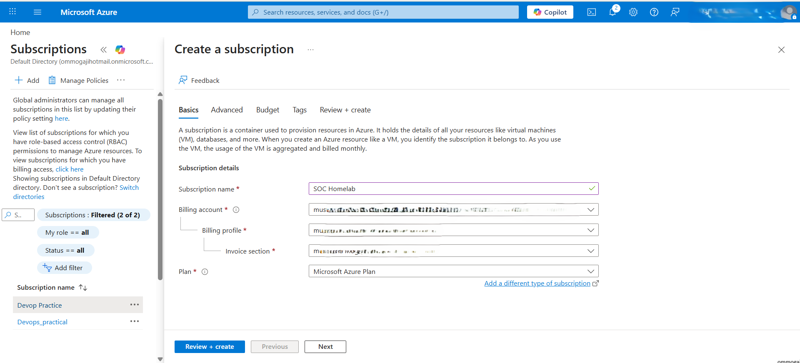

A resource group (`Automation_ruleRG`) was created in the East US region under the `SOC Homelab` subscription. The resource group was tagged with `Task: SOC Workflow` to make resource tracking straightforward.

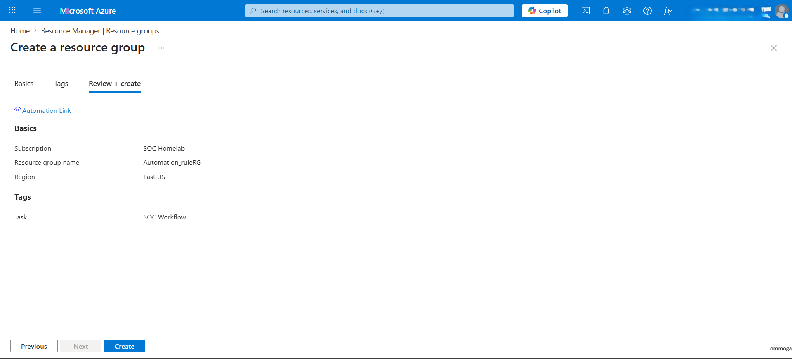

Microsoft Sentinel requires an Azure Log Analytics Workspace as its data store — Sentinel is a SIEM and does not store logs itself; it operates on data held in the workspace. A Log Analytics Workspace named `Homelab-workspace` was created in the same resource group.

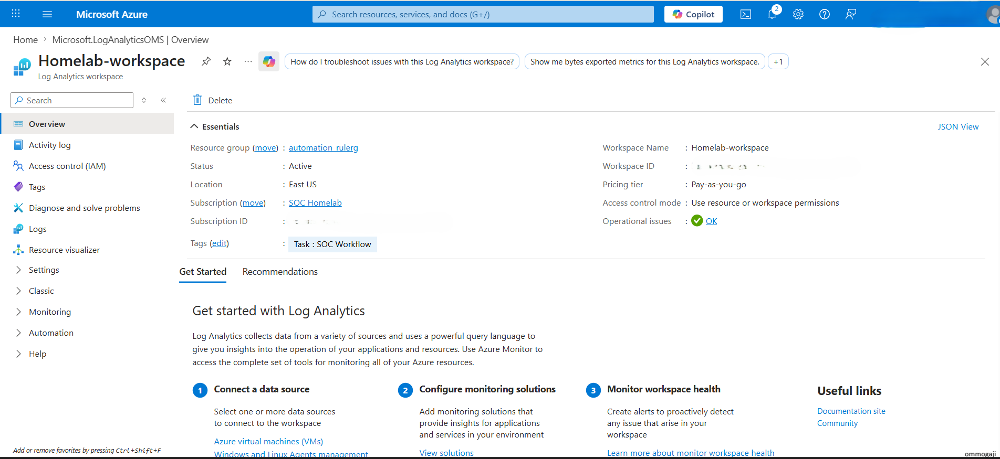

Microsoft Sentinel was then enabled on `Homelab-workspace`. After enabling, Sentinel was migrated to the Microsoft Defender portal. Microsoft encourages this migration as there is a deadline of **31 March 2027** for existing Sentinel workspaces to move to the unified Defender portal for a consolidated SecOps experience.

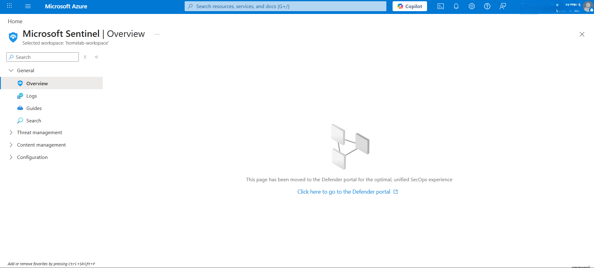

---

### Step 2: Detection Rule Creation

With the environment set up, the next step was to create a detection rule to simulate alert generation. Navigating to **Microsoft Sentinel → Analytics** in the Defender portal, a new **Scheduled Query Rule** was created.

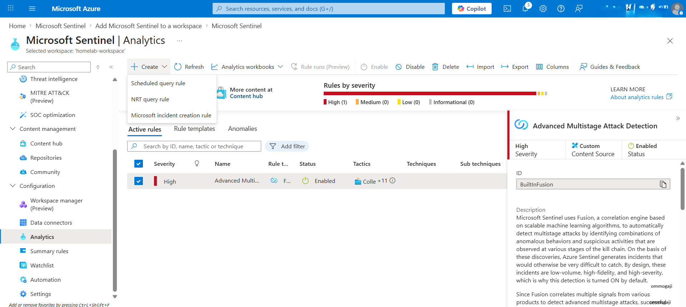

Since there was no live log ingestion in this home lab environment, a static dataset was generated using the KQL `datatable` operator to ensure the query consistently returned results:

```kql
datatable(User:string, IP:string)
[
    "labuser","192.168.1.10"
]
```

This approach allowed reliable testing of the full automation pipeline without depending on live data connectors.

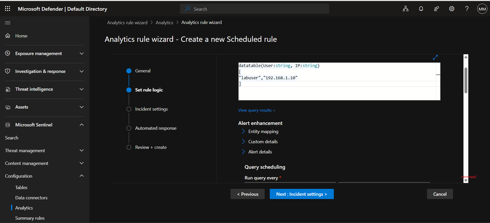

The rule scheduling was configured to run every **5 minutes**, looking up data from the last **5 minutes**, starting automatically. The alert threshold was set to trigger when query results are greater than zero, and the rule was configured to automatically group alerts into incidents.

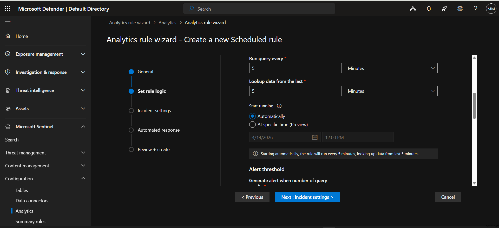

This rule served as the detection engine for the entire workflow.

---

### Step 3: Playbook Development

The playbook is the automated response mechanism — it defines what happens when an incident is created. In this lab, the goal was to receive an email notification every time an incident is generated.

The playbook was built using Azure Logic Apps, initiated from the **Automation → Playbooks** section in the Defender portal by selecting **Logic App playbook → Playbook with incident trigger**.

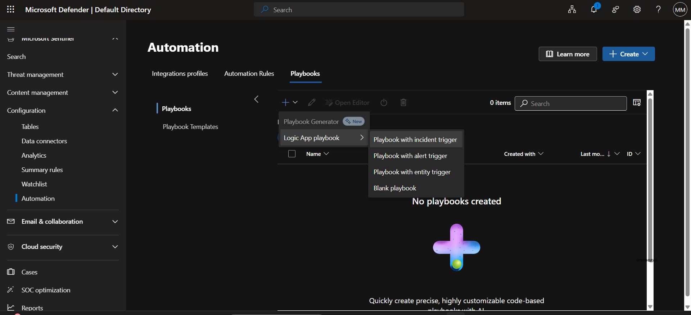

The playbook (`test_SOCworkflow`) was deployed to the `Automation_ruleRG` resource group under the `SOC Homelab` subscription, linked to the `homelab-workspace` Sentinel workspace.

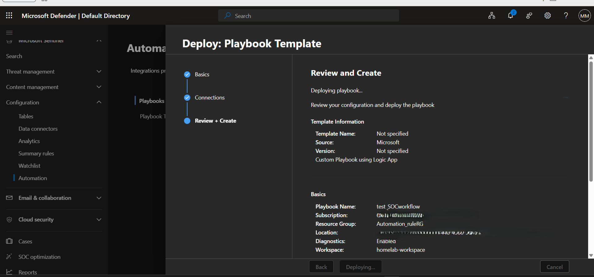

During deployment, the Microsoft Sentinel API connection was configured to allow the Logic App to interact with Sentinel incidents.

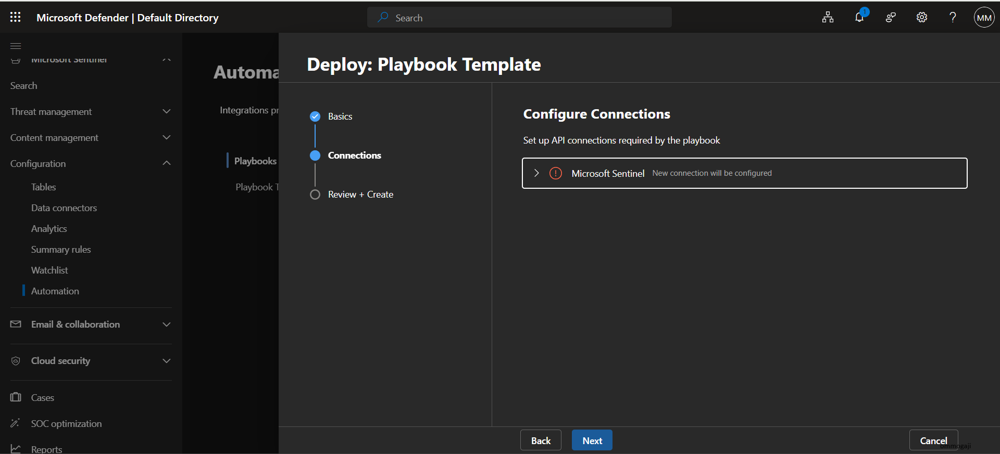

In the Logic App designer, the **Microsoft Sentinel incident** trigger was set as the starting point of the workflow.

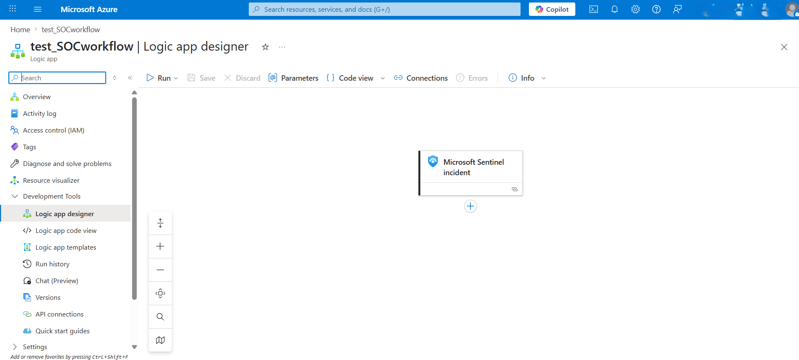

The next step was to add the email action. Searching for "Send email" in the action panel returned results from both **Outlook.com** and **Office 365 Outlook**.

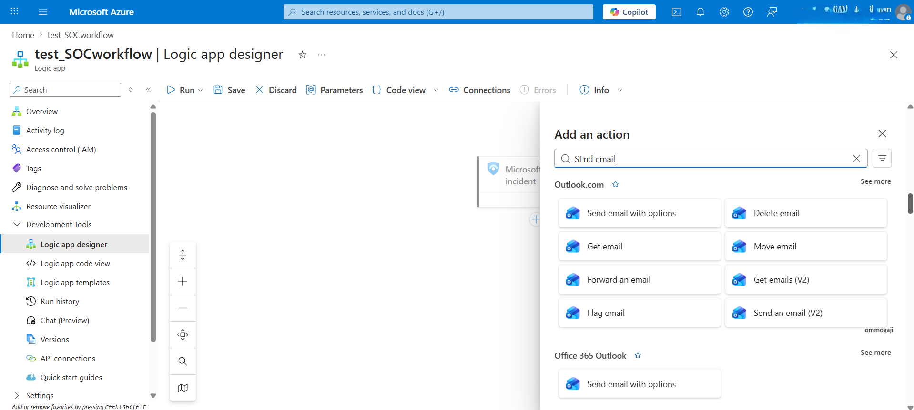

> ⚠️ **Error encountered:** When initially selecting **Office 365 Outlook → Send email with options**, a 401 Unauthorized error was returned during connection setup.
>
> 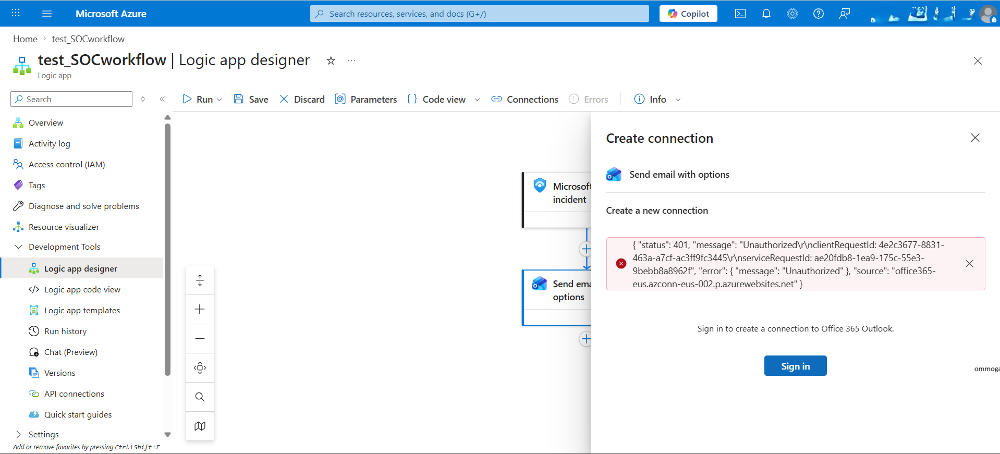
>
> **Root cause:** Office 365 Outlook is for work or school accounts. Since a personal Microsoft account was being used for this lab, the correct connector was **Outlook.com**, not Office 365 Outlook. Switching to the Outlook.com connector resolved the issue immediately.

---

### Step 4: Automation Rule Configuration

With the playbook ready, an **Automation Rule** was created to act as the decision-making layer between incident creation and playbook execution. The automation rule was configured with:

- **Trigger:** When an incident is created
- **Condition:** Analytic rule name contains `test_SOCworkflow`
- **Action:** Run playbook → `test_SOCworkflow`
- **Rule expiration:** Indefinite
- **Order:** 1

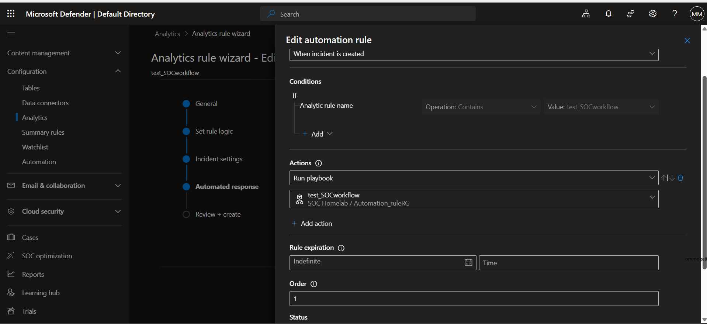

The automation rule is what connects the detection to the response — when Sentinel generates an incident from the analytics rule, the automation rule fires and calls the Logic App playbook.

---

### Step 5: Simulation and Validation

The workflow was tested end-to-end. Because the analytics rule runs every 5 minutes and consistently returns results (due to the static `datatable` query), incidents were generated automatically and repeatedly.

The Defender portal confirmed the pipeline was working — **33 incidents** named `test_SOCworkflow` were generated, all with Medium severity, categorised as Suspicious Activity.

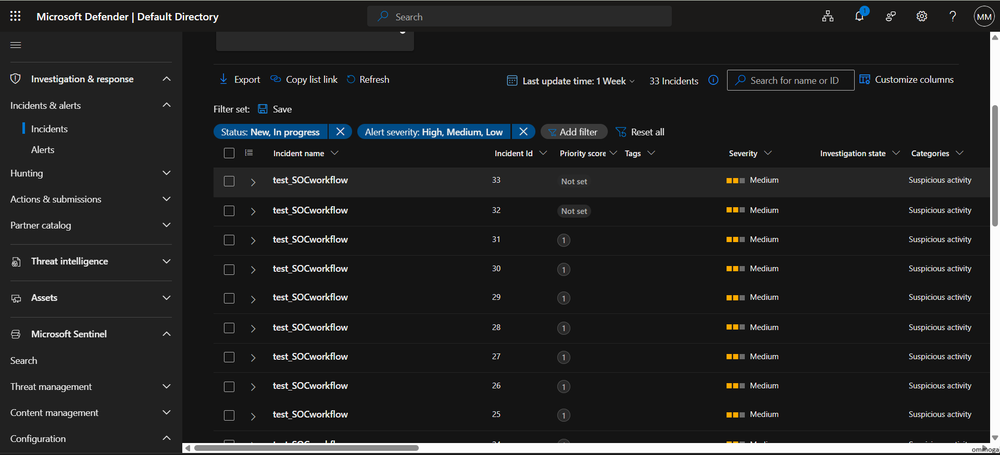

The Logic App metrics confirmed the playbook executed successfully, showing **2 Triggers Completed** in the monitoring view.

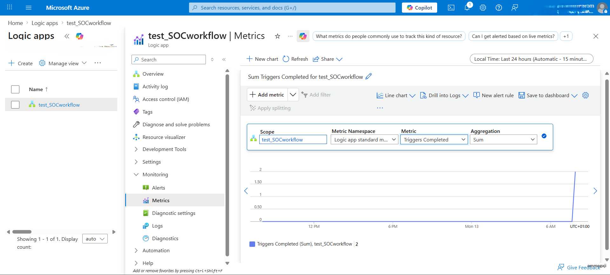

Email notifications were received in the personal Outlook inbox for each incident created, confirming the full end-to-end SOAR workflow was functioning as designed.

---

## Lessons Learnt

**1. Understanding Analytics Rule Types**

Implementing this lab deepened my understanding of the three main Sentinel analytics rule types:
- **Scheduled Query Rule** — runs KQL queries on a defined schedule, ideal for custom detections
- **Near-Real-Time (NRT) Rule** — runs approximately every minute for faster detection
- **Fusion Rule** — uses machine learning to correlate signals across multiple data sources into high-fidelity incidents

**2. Outlook.com vs Office 365 Outlook Connector**

The 401 Unauthorized error when using Office 365 Outlook was an important practical lesson. Office 365 Outlook connects to work/school accounts managed by an organisation. For personal Microsoft accounts, the correct connector is Outlook.com. Selecting the wrong connector type causes an authentication failure that can be easily misidentified as a permissions issue.

**3. Scheduled Query Rules and Static Data**

Using the `datatable` operator to generate synthetic data was an effective workaround for testing detections without live log ingestion. This technique is useful in home lab environments and for unit-testing detection logic before deploying to production.

**4. Incident Lifecycle Understanding**

This lab gave me hands-on visibility of the full incident lifecycle:
- Analytics rule fires → alert generated → alert grouped into incident → automation rule triggered → playbook executed → notification delivered

Understanding this pipeline end-to-end is directly applicable to SOC work, particularly for building and validating automated response workflows.

---

## Repository Structure

```
Sentinel-SOAR-Lab/
├── README.md
└── screenshots/
    ├── Creating_RG.png
    ├── Creating_subscription.png
    ├── Creating_analytic_rule.png
    ├── Creating_playbook_def.png
    ├── Log_Analytics_Workspace.png
    ├── logic_app_deisgner2.png
    ├── Logic_app_design_error.png
    ├── Logic_app_designer.png
    ├── Microsoft_Sentinel.png
    ├── Palybook_deployment.png
    ├── Playbook_added.png
    ├── Playbook_performance_metric.png
    ├── Playbook_Sentinel_API_config.png
    ├── Schedule_query_runtime.png
    ├── Sentinel_moved_to_defender.png
    └── Simulate_incident_creation.png
```

---

## Contact

**Olakunle Mogaji**
- LinkedIn: [linkedin.com/in/mustapha-mogaji-9215aa108](https://linkedin.com/in/mustapha-mogaji-9215aa108)
- Email: ommogaji@hotmail.com
- GitHub: [github.com/qoonleyh](https://github.com/qoonleyh)
